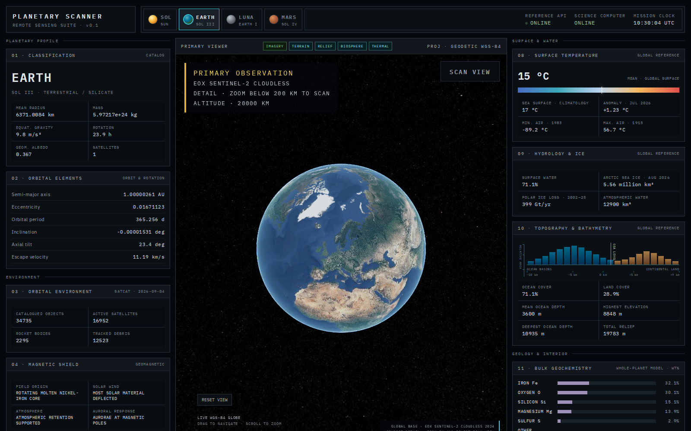
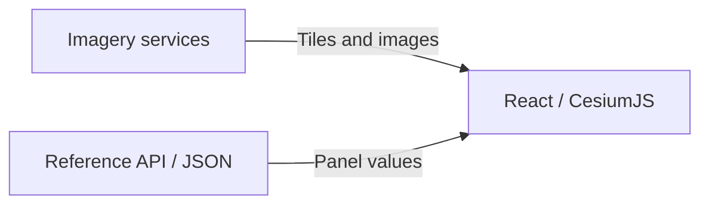
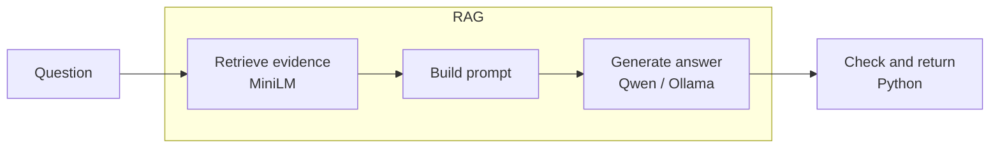

# PlanetaryScanner

A learning project in local language models, embeddings, and retrieval-augmented generation (RAG). A fictional planetary scanner provides the interface, with real scientific data for Earth, the Moon, Mars, and the Sun.

The science computer combines a local Qwen language model with MiniLM semantic retrieval and source-backed reference records. React, TypeScript, CesiumJS, and FastAPI connect the interface to the answer pipeline.

## Learning guide

[Local LLMs, embeddings, and RAG](docs/ai-pipeline.md) explains the project in detail: how the two models work, how evidence reaches an answer, how retrieval scores should be read, and how to test the system. It includes diagrams, worked examples, and experiments you can run locally.



Full screenshots: [Sol](.github/sol-full.png), [Earth](.github/earth-full.png), [Luna](.github/luna-full.png), [Mars](.github/mars-full.png).

## Viewers

| Body  | Imagery and layers                                                          |
| ----- | --------------------------------------------------------------------------- |
| Earth | Sentinel-2, terrain, GEBCO relief, vegetation, and surface temperature      |
| Luna  | LROC imagery and LOLA relief                                                |
| Mars  | Viking MDIM, THEMIS infrared, and MOLA relief                               |
| Sol   | AIA 171 Å synoptic globe, visible light, EUV observations, and magnetograms |

Drag a globe to rotate and scroll to zoom. Solar disk images support pan, zoom, and UTC date selection. Reference panels cover physical properties, composition, environment, and interior structure.

## Run locally

Requires Python 3.12+, [uv](https://docs.astral.sh/uv/), Node.js 22.12+, and npm. Internet access is needed for map services and initial model downloads.

Install dependencies from the repository root:

```bash
uv sync
npm --prefix frontend ci
```

Start the API:

```bash
uv run uvicorn planetary_scanner.api.main:app --host 127.0.0.1 --port 8000
```

In another terminal, start the website:

```bash
npm --prefix frontend run dev -- --port 5174
```

Open [localhost:5174](http://localhost:5174). The frontend proxies API requests to port 8000. Process environment variables configure the API; see [.env.example](.env.example). Stop services with Ctrl+C.

### Local answers

Install [Ollama](https://ollama.com/) and start it if needed:

```bash
ollama serve
```

Download the answer model in another terminal:

```bash
ollama pull qwen2.5:3b
```

The science computer uses Qwen2.5:3b with MiniLM reference retrieval. CPU inference is supported. The first query downloads the embedding model if it is not cached. Set `OLLAMA_BASE_URL` on the API process to use an Ollama address other than `http://127.0.0.1:11434`.

## Architecture

### Viewers



The browser loads imagery and displays reference facts. FastAPI handles scene and observation lookups. The viewers remain available when Ollama is offline.

### Science computer



RAG retrieves reference records, adds their text to the question and instructions, and asks Qwen to generate an answer. Python checks the response and attaches its evidence. Named bodies take priority over the active tab, and comparisons can retrieve evidence for all four bodies. Qwen receives text, not imagery.

Python asks for clarification when a ratio lacks a property and calculates supported numeric ratios directly. These paths do not call Qwen.

Generated answers are checked for unsupported numbers and selected scientific qualifiers. A failed check gets one correction attempt, then an evidence-limitation response if it still fails. These safeguards improve the application around Qwen without training its weights. The [learning guide](docs/ai-pipeline.md#how-the-application-improves-answers) explains the changes and their limits.

## Data

Facts retain their source, unit, date, and scope in [data/reference](data/reference). The [source registry](data/reference/sources.json) lists the underlying publications and services.

The searchable collection contains **5,956 records**: summary facts, lunar and Martian surface features, historical earthquakes, solar activity observations, nearby exoplanets, and astronomy explanations. Solar-system and Milky Way questions are available from every tab. The [corpus manifest](data/reference/corpus/manifest.json) records snapshot dates, download hashes, selection rules, and counts.

Solar activity data is adapted from WDC-SILSO, Royal Observatory of Belgium, Brussels, [International Sunspot Number](https://doi.org/10.24414/qnza-ac80), under [CC BY-NC 4.0](https://creativecommons.org/licenses/by-nc/4.0/). Numeric means are retained and converted into attributed reference text.

## GitHub Pages demo

A GitHub Pages demo is planned but not yet published. It will let visitors explore the planetary viewers and reference panels, with the LLM-powered science computer disabled. Answer generation requires an active model server and compute resources beyond the static website.

This is a small portfolio project demonstrating practical work with and understanding of local LLMs, text encoders, and RAG. The full answer pipeline can be run locally using the setup above. The [learning guide](docs/ai-pipeline.md) explains its implementation.

### Static build

```bash
npm --prefix frontend run build:demo
```

This produces `frontend/dist` with bundled facts, dated solar snapshots, and Cesium assets. It needs no API or language model. Earth scene scanning and live solar date selection require the local app. The default URL prefix is `/planetary-scanner/`; set `PAGES_BASE_PATH` for another path. The build does not publish anything.

## Development

```bash
uv run pytest -q
uv run ruff check src tests scripts
uv run ruff format --check src tests scripts
uv run python scripts/evaluate_reference_retrieval.py
npm --prefix frontend run format:check
npm --prefix frontend run lint
npm --prefix frontend run build
```

Use `uv run ruff format src tests scripts` and `npm --prefix frontend run format` to format the source.

The retrieval evaluation runs 52 saved questions across all six collections with the real MiniLM encoder. It needs cached model files or an initial download, but does not call Qwen. Passing retrieval checks does not establish generated-answer accuracy.

The frontend lives in `frontend/src`; API and retrieval modules are in `src/planetary_scanner`. Tests cover reference validation, retrieval, grounding, and imagery endpoints.

## License

A project license has not been assigned. Third-party assets retain their credits and licenses.
