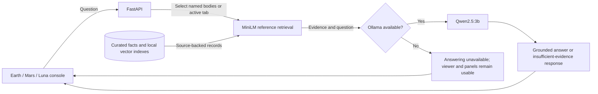

# PlanetaryScanner

[](https://www.python.org/)
[](https://fastapi.tiangolo.com/)
[](https://react.dev/)
[](https://cesium.com/platform/cesiumjs/)

**Explore Earth, Mars, and the Moon. Ask a local science computer what the reference data says.**

PlanetaryScanner combines zoomable CesiumJS globes, compact scientific reference panels, and source-backed answers. The API, reference datasets, and language model run locally; map imagery comes from external scientific services. CPU inference is supported, so a GPU is optional.

## Explore the console

| Body | Viewer layers | Reference panels |
| --- | --- | --- |
| **Earth** | Sentinel-2 imagery, terrain, GEBCO relief, vegetation, and surface temperature | Orbit, atmosphere, biosphere, civilisation, geochemistry, and interior |
| **Mars** | Viking MDIM imagery, THEMIS infrared, and MOLA relief | Orbit, magnetic environment, atmosphere, water, geochemistry, and interior |
| **Moon / Luna** | LROC imagery and LOLA relief on a lunar globe | Orbit, exosphere, water and ice, Apollo exploration, bulk silicate geochemistry, and interior |

The three viewers share a consistent frame. Lunar panels follow the Mars layout, with gray terrain and geochemistry graphics and a blue-to-red temperature scale.

## Science computer



The science computer retrieves relevant reference facts before generating an answer; unavailable model services do not prevent globe exploration.

| Question | Evidence selected |
| --- | --- |
| “What is the mean radius?” | The body selected in the console |
| “What is the Moon made of?” | Luna, including its bulk silicate composition model |
| “Compare Earth and the Moon by gravity.” | Earth and Luna |
| “Compare the size and gravity of all three bodies.” | Earth, Mars, and Luna |

“Moon,” “Luna,” and “lunar” refer to the same body. Explicit body names override the selected tab. Each factual record retains its value, unit, scope, date, and source metadata. Answers use retrieved reference records; the language model does not receive raw imagery.

Lunar geochemistry bars show **oxide weight percentages for the mantle and crust, excluding the metallic core**, from the Warren (2005) model reproduced by Charlier et al. (2018). These are model estimates. The lunar relief sidebar profile is labeled schematic. Fictional Dilithium scenarios remain separate from factual records and grounded answers.

## Run locally

Run the commands below from the repository root.

| Requirement | Purpose |
| --- | --- |
| Python **3.12+** and [uv](https://docs.astral.sh/uv/) | Reference API and retrieval pipeline |
| Node.js **22.12+** and npm | React / Vite frontend |
| [Ollama](https://ollama.com/) | Optional local answer generation |
| Internet access | Dependencies, initial model downloads, and external map layers |

### 1. Install dependencies

```bash
uv sync
(cd frontend && npm ci)
```

### 2. Start the reference API

```bash
uv run uvicorn planetary_scanner.api.main:app --host 127.0.0.1 --port 8000
```

### 3. Start the website in another terminal

```bash
cd frontend
npm run dev
```

Open **http://localhost:5173**. The frontend proxies API requests to port 8000.

### 4. Enable local answers

If Ollama is not already running, start it in a separate terminal:

```bash
ollama serve
```

Then download the answer model:

```bash
ollama pull qwen2.5:3b
```

The first science-computer query also loads the MiniLM embedding model and may download it if it is not cached. The checked-in Earth, Mars, and Luna reference records and vector indexes are ready to use. Later queries use the cached models.

<details>
<summary>Windows / PowerShell setup</summary>

Install dependencies:

```powershell
uv sync
Set-Location frontend
npm ci
Set-Location ..
```

Run the same API and Ollama commands shown above in separate terminals. For the frontend:

```powershell
Set-Location frontend
npm run dev
```

</details>

### Ports and configuration

| Service | Default address |
| --- | --- |
| Website | `http://localhost:5173` |
| Reference API | `http://127.0.0.1:8000` |
| Ollama | `http://127.0.0.1:11434` |

To use Ollama on another port, set `OLLAMA_HOST` for Ollama and `OLLAMA_BASE_URL` for the API. For example, on Linux:

```bash
OLLAMA_HOST=127.0.0.1:11435 ollama serve
OLLAMA_HOST=127.0.0.1:11435 ollama pull qwen2.5:3b
OLLAMA_BASE_URL=http://127.0.0.1:11435 uv run uvicorn planetary_scanner.api.main:app --host 127.0.0.1 --port 8000
```

Run the server commands in separate terminals. In PowerShell, set variables with `$env:OLLAMA_HOST = "127.0.0.1:11435"` and `$env:OLLAMA_BASE_URL = "http://127.0.0.1:11435"` before running the respective commands.

The API reads process environment variables; it does **not** automatically load `.env`. See [.env.example](.env.example). If you change the API port, update the proxy targets in [frontend/vite.config.ts](frontend/vite.config.ts) to match.

Stop manually launched services with **Ctrl+C** in their terminals.

## Repository guide

| Location | Contents |
| --- | --- |
| [frontend/src](frontend/src) | Console, shared panels, and Earth / Mars / Luna viewers |
| [src/planetary_scanner/api](src/planetary_scanner/api) | Reference facts, answers, health, and imagery endpoints |
| [src/planetary_scanner/rag](src/planetary_scanner/rag) | Reference indexing, retrieval, and grounded answer generation |
| [data/reference](data/reference) | Curated datasets, source registry, and retrieval artifacts |
| [tests](tests) | Data validation, retrieval, grounding, API, and imagery checks |

## Checks

From the repository root:

```bash
uv run pytest -q
uv run ruff check src tests
(cd frontend && npm run lint && npm run build)
```

## License

License selection is pending while the repository remains private.
