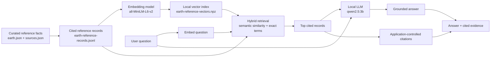

# PlanetaryScanner

[](https://www.typescriptlang.org/)
[](https://react.dev/)
[](https://vite.dev/)
[](https://www.python.org/)

Local-first planetary science console and cited RAG learning project. PlanetaryScanner is developing structured, source-cited planetary facts, an interactive spatial viewer, and a grounded Science Computer.

## Status

Prototype. The React client provides a CesiumJS Earth reference console backed by a local
FastAPI service and a local retrieval pipeline. Its explicit **SCAN VIEW** workflow provides
exploratory display-only layers from Microsoft Planetary Computer: Sentinel-2 RGB imagery,
Sentinel-2 NDVI, Copernicus DEM elevation, and 8-day daytime MODIS land-surface temperature.
These map products do not enter the RAG context.

MODIS thermal display uses the `modis-11A2-061` `LST_Day_1km` product: a 1 km,
8-day, daytime land-surface-temperature composite. It is not an air-temperature measurement
or raw long-wave infrared radiance. The viewer calculates a viewport-specific 2nd–98th
percentile display range from source statistics, renders it in Kelvin, and reports its legend
in degrees Celsius.

## Scientific Integrity

Factual panel values will be stored as versioned reference facts with a value, unit, scope, date, and source locator. Spatial measurements will remain separate scan records. The Dilithium scenario and Prime Directive content are explicitly fictional and excluded from factual retrieval.

## Local Grounded RAG

The Science Computer uses retrieval-augmented generation (RAG) to answer from local,
source-backed reference records. The language model is not asked to supply citations or
choose scientific evidence; those remain application-controlled.



The system works in these steps:

1. Curated facts are validated against the source registry, then rendered into readable
	JSON Lines records. Each record retains its value, unit, scope, date, source locator,
	and URL.
2. The embedding model converts each record into a 384-number vector once. The derived
	vectors and their record IDs are saved locally in the `.npz` index.
3. A user question is embedded by the same model. Exact cosine search ranks semantically
	relevant records, with a small exact-token boost for scientific terms such as `CO2`
	and `J2000`.
4. The top records become the only evidence supplied to Ollama. The local LLM writes a
	short JSON answer or states that the evidence is insufficient.
5. The application attaches the original retrieved records as citations, so citations
	cannot be invented by the LLM.

Two versioned evaluation sets protect the pipeline:

- Retrieval evaluation checks whether the intended record occurs in the top $k$ results.
  The current Earth baseline is `Recall@3: 5/5`.
- Grounded-answer evaluation checks required citations, sufficient/insufficient-evidence
  status, and essential answer terms such as values and units. The current baseline is
  `3/3` local-model cases.

The local endpoints are `GET /retrieval/reference` for evidence inspection and
`GET /answers/reference` for grounded answers with citations.

## Deferred: Reference Database

The local file-backed corpus is the active retrieval baseline. PostgreSQL with pgvector is
deferred until Docker can be used comfortably on the development machine. It remains the
planned scalable reference-record store for automated ingestion and metadata-aware vector
retrieval.

**Later todo:** run the idempotent schema at
`database/init/001_reference_records.sql`, implement the importer and PostgreSQL
retriever, and demonstrate retrieval equivalence to the current JSONL/NPZ evaluation
baseline before switching API storage.

## Local Development

The frontend is currently the runnable component:

```powershell
cd frontend
npm install
npm run dev
```

Run quality checks with:

```powershell
npm run build
npm run lint
```

## Roadmap

1. Versioned Earth reference facts with provenance.
2. FastAPI contract for facts, citations, and viewer directives.
3. CesiumJS Earth viewer with a self-contained ellipsoid, followed by local or openly accessible imagery.
4. Local RAG pipeline with optional personal API-provider support.
5. Docker Compose and reproducible evaluation.

## License

License selection is pending while the repository remains private.