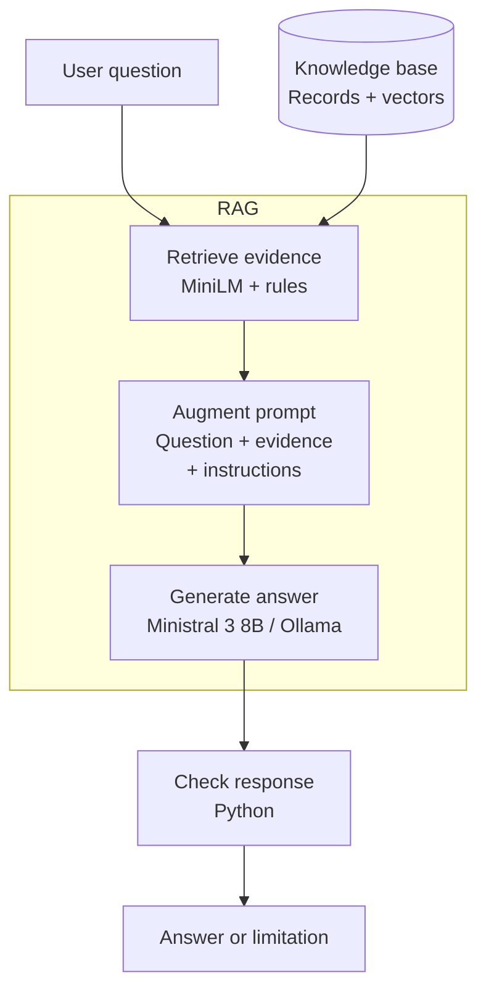
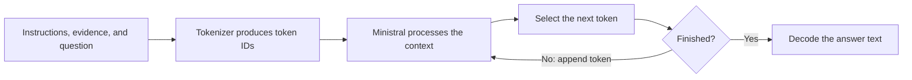
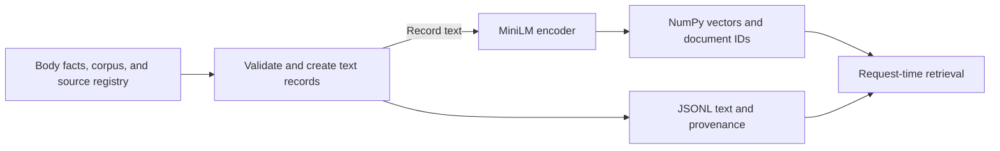
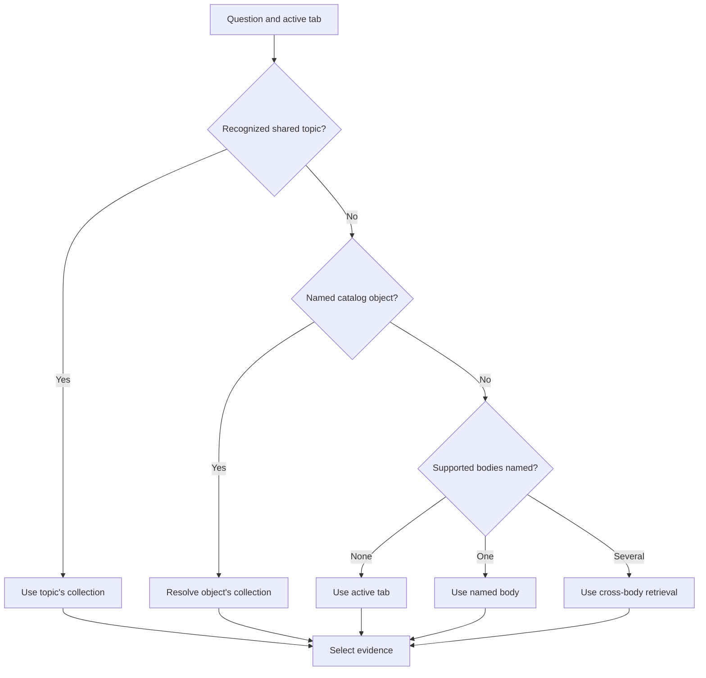
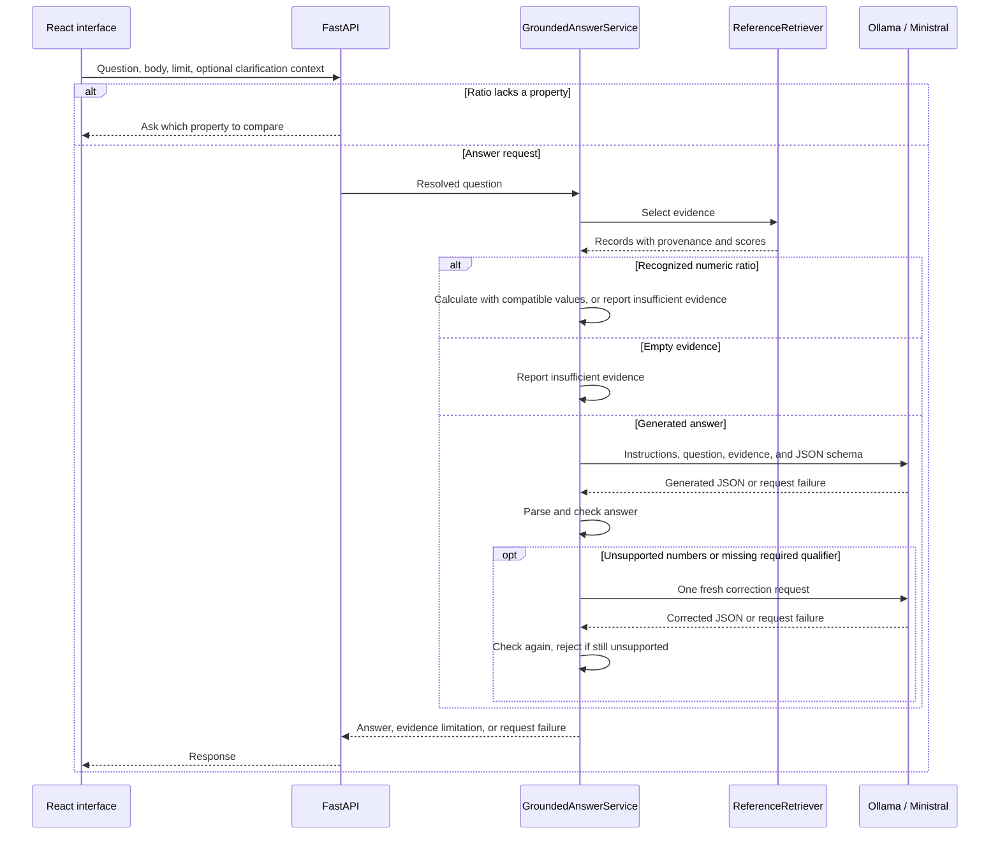

# Local LLMs, embeddings, and RAG

PlanetaryScanner is a learning project about running a local language model, finding relevant evidence with a text encoder, and combining them through retrieval-augmented generation (RAG). The planetary scanner provides an interface for exploring that work.

This guide explains the models, the answer pipeline, and its limits. See the [README](../README.md) for installation and startup.

## Contents

1. [The three responsibilities](#the-three-responsibilities)
2. [The LLM: generating an answer](#the-llm-generating-an-answer)
3. [The encoder: finding related text](#the-encoder-finding-related-text)
4. [Preparing the reference data](#preparing-the-reference-data)
5. [Choosing evidence for a question](#choosing-evidence-for-a-question)
6. [Building and processing an answer](#building-and-processing-an-answer)
7. [Comparisons, composition, and scientific scope](#comparisons-composition-and-scientific-scope)
8. [Evaluation and its limits](#evaluation-and-its-limits)
9. [Running and updating the pipeline](#running-and-updating-the-pipeline)
10. [Finding the implementation](#finding-the-implementation)

## The three responsibilities



RAG retrieves relevant records, adds their text to the question and instructions, then asks Ministral to generate an answer. Python checks the result before returning it. The diagram shows the generation path. Clarifications and supported numeric ratios return directly without calling Ministral.

| Component                  | Implementation                           | Responsibility                                                |
| -------------------------- | ---------------------------------------- | ------------------------------------------------------------- |
| Large language model (LLM) | `ministral-3:8b` through Ollama          | Generate readable answers                                     |
| Text encoder               | `sentence-transformers/all-MiniLM-L6-v2` | Represent questions and records as vectors for search         |
| RAG pipeline               | Python retrieval and answer modules      | Choose evidence, construct the prompt, and check the response |

RAG means retrieving information for a question and including it in the model's input. It lets reference data change without retraining the answer model. The [original RAG paper](https://arxiv.org/abs/2005.11401) describes the research approach. This application uses pretrained models and its own retrieval rules, rather than reproducing that training system.

The repository does not train or fine-tune Ministral or MiniLM. The custom work is data preparation, indexing, routing, prompt design, validation, and evaluation. Reference panels use direct data lookup. Generated answers use retrieval and a model prompt. Supported numeric ratios use a Python calculation.

Ministral receives reference text, not imagery. It does not inspect the globe, read pixels, or discover deposits from the map. Fictional dilithium deposits are excluded from factual retrieval.

### How the application improves answers

The improvements change which evidence reaches Ministral and which responses the application accepts.

| Change                                               | Effect                                                              |
| ---------------------------------------------------- | ------------------------------------------------------------------- |
| Clarify unspecified ratios                           | Ask whether a comparison concerns mass, radius, or another property |
| Retrieve matching properties for each body           | Avoid comparing unrelated measurements                              |
| Calculate supported ratios in Python                 | Keep arithmetic outside generated prose                             |
| Recognize named objects and shared topics            | Find Tycho or exoplanet evidence regardless of the active tab       |
| Preserve scope in the prompt                         | Keep units, estimates, and scientific qualifiers attached to values |
| Check numbers and selected qualifiers                | Request one correction, then reject an answer that still fails      |
| Replace insufficient answers with a clear limitation | Prevent refusals from also presenting unrelated measurements        |

These changes address specific failures. They do not change Ministral's weights or establish that every answer is correct.

## The LLM: generating an answer



Ministral generates text by repeatedly predicting and selecting a next token.

A **token** can be a word, part of a word, punctuation, or another text fragment. The tokenizer converts text into vocabulary IDs. Those IDs are different from MiniLM's search vectors. See Hugging Face's [tokenizer](https://huggingface.co/docs/transformers/main/en/tokenizer_summary) and [generation](https://huggingface.co/docs/transformers/main/en/llm_tutorial) documentation.

**Parameters** are numerical weights learned during training. Ministral uses a Transformer architecture, whose attention calculations combine information from token positions. These calculations support generation but do not verify scientific claims. The architecture is described in [Attention Is All You Need](https://arxiv.org/html/1706.03762v7).

The **context window** is the token capacity available to a request. Instructions, evidence, the question, and output consume that capacity. Each generated answer here uses a fresh prompt. The interface keeps a visible query and answer log and clears the input after submission. This display history is not sent to the model and is cleared when switching bodies or reloading the page. General conversation history and Ollama's returned generation context are not forwarded. One ambiguous ratio question can be retained to interpret a short clarification reply such as “mass”. Changing tabs clears it.

### Model and generation settings

The default `ministral-3:8b` uses Mistral AI’s instruction-tuned Ministral 3 8B model, with an 8.4-billion-parameter language model and a 0.4-billion-parameter vision encoder. The application uses text input only. Instruction tuning prepares a model to respond to requests. Ollama runs it and exposes the HTTP endpoint used by Python. See the [Mistral model card](https://huggingface.co/mistralai/Ministral-3-8B-Instruct-2512).

The [Ollama listing](https://ollama.com/library/ministral-3:8b) identifies the distributed artifact as `Q4_K_M`. This is a quantized representation, using lower precision to reduce weight storage. Model file size is not total runtime memory usage.

| Setting                         | Current value                                 |
| ------------------------------- | --------------------------------------------- |
| Answer model                    | `ministral-3:8b`                              |
| Temperature                     | `0`, a low-variability setting                |
| Output format                   | JSON schema generated by Pydantic             |
| Streaming                       | Disabled                                      |
| HTTP timeout                    | 120 seconds per generation request            |
| Context and output token limits | Not explicitly set, so runtime defaults apply |

The adapter calls Ollama's [`/api/generate`](https://docs.ollama.com/api/generate) endpoint. A zero temperature does not guarantee correctness or identical results across runtimes.

A larger model may follow instructions and combine evidence more reliably, but that needs measurement on this application's questions. More parameters do not repair missing or incorrect records, and replacing Ministral leaves MiniLM retrieval unchanged. The manual 8B checks below do not establish how other model sizes compare on this application.

## The encoder: finding related text


MiniLM turns text into a fixed-length numerical representation for comparison.

An **embedding** is a vector representing text in a learned space. Related questions such as “How much does Earth weigh?” and “What is Earth's mass?” can be close to the same mass record, despite different wording. That similarity is useful for search, but does not guarantee correct interpretation of weight versus mass. The [Sentence-BERT paper](https://arxiv.org/abs/1908.10084) explains sentence embeddings and semantic comparison.

The [MiniLM model card](https://huggingface.co/sentence-transformers/all-MiniLM-L6-v2) specifies 384-dimensional embeddings and a default input limit of 256 word pieces. Longer inputs are truncated. The application calls `encode(..., normalize_embeddings=True)` for documents and questions.

Document vectors are computed when an index is built. Each question needs a new vector. Both must use the same encoder. Equal vector dimensions alone do not make different embedding models compatible.

The coordinates are learned representations, not named properties such as temperature or gravity. Python uses them to select records, then sends the original record text to Ministral. Ministral never receives MiniLM's vectors.

### Similarity and ranking

Normalized vectors have length approximately one. Their dot product gives cosine similarity:

```text
cosine(q, d) = (q · d) / (||q|| × ||d||)

For unit-length vectors: cosine(q, d) = q · d
```

The search compares a question with every indexed document using NumPy:

```python
scores = index.vectors @ question_vector[0]
```

A larger score means closer vector directions. **A score of 0.738 is not 73.8% confidence.** Similarity does not establish truth, answerability, or generated-answer accuracy.

Ordinary retrieval combines semantic similarity with exact-term coverage:

```text
lexical_score = shared question/document tokens / unique question tokens
hybrid_score = 0.85 × ((cosine_score + 1) / 2) + 0.15 × lexical_score
```

The weights are application settings, not learned confidence probabilities. The lexical check uses lowercase regex tokens, without sophisticated language analysis. Results expose the original cosine score even when the hybrid score determines their order.

## Preparing the reference data



Index preparation stores searchable vectors separately from the text used as evidence.

Small JSON datasets supply the viewer panels. Larger research records live in [`data/reference/corpus`](../data/reference/corpus). The builder merges both into six collections:

| Collection   |   Records |
| ------------ | --------: |
| Earth        |       625 |
| Luna         |     2,134 |
| Mars         |     2,143 |
| Sol          |       733 |
| Solar system |       102 |
| Milky Way    |       219 |
| **Total**    | **5,956** |

The two shared collections are available from every viewer tab. Most additions describe surface features, so record count should not be read as an equal increase in explanatory depth.

### What a record contains

A summary fact retains its ID, property, value, unit, scope, date, source ID, and source locator. **Scope** defines what a statement or measurement describes. **Provenance** identifies where it came from. Corpus profiles retain their text and provenance in a validated `KnowledgeRecord`.

Each fact, profile, observation, or explanation becomes one retrieval document, or **chunk**. This project does not split long PDFs into overlapping paragraphs. One catalog profile can contain several measurements while remaining one record.

For example, `reference-fact-mars-mean-radius` contains:

```text
Mars reference fact: mean radius is 3389.5 km.
Scope: volume equivalent sphere. As of: 2019-12-12.
Source: NASA Jet Propulsion Laboratory Solar System Dynamics,
Planetary Physical Parameters. Locator: Mars row, Mean Radius.
URL: https://ssd.jpl.nasa.gov/planets/phys_par.html.
```

Line breaks are added here for readability. The encoder embeds the record's full content, subject to its input limit. Metadata remains available for property selection and calculations.

Each collection has a JSONL record file and an `.npz` archive containing `document_ids`, `vectors`, and `model_name`. The Mars vector matrix is `(2143, 384)`. Search scans these vectors with NumPy and joins selected IDs to their text. This pipeline does not require a database.

### Source coverage and limits

The additions to the original 412 facts are:

| Source                  | Added records | Selection and interpretation                                                                                                                                                   |
| ----------------------- | ------------: | ------------------------------------------------------------------------------------------------------------------------------------------------------------------------------ |
| USGS/IAU Gazetteer      |         4,074 | Named lunar and Martian features, excluding lunar satellite letter designations. Identical repeated IDs are removed. Zero diameters mean unavailable                           |
| USGS earthquake catalog |           504 | Magnitude at least 7.5, from 1900 through 2025. Historical completeness varies, and missing depths remain unavailable                                                          |
| SILSO                   |           638 | Yearly means for 1700–2025 and monthly means for 2000–2025. Early annual coverage can be sparse. Sunspot numbers are activity indices, not instantaneous spot counts           |
| NASA Exoplanet Archive  |           150 | Nearest planets from default Planetary Systems solutions with reported distances at most 20 parsecs. One solution per profile, with missing fields omitted and limits retained |
| NASA educational pages  |           178 | Curated explanations with page citations and update dates                                                                                                                      |

Gazetteer coordinates use planetocentric latitude and east longitude. Exoplanet `M sin i` values remain minimum masses. Catalog measurements do not establish habitability or life.

Solar activity records are adapted from WDC-SILSO, Royal Observatory of Belgium, Brussels, under [CC BY-NC 4.0](https://creativecommons.org/licenses/by-nc/4.0/). The [source registry](../data/reference/sources.json) holds citations. The [manifest](../data/reference/corpus/manifest.json) records download URLs, SHA-256 hashes, selection rules, and indexed counts.

Validation rejects duplicate IDs, unregistered sources, invalid coordinates, and non-finite imported numbers. Summary measurements require units. These checks establish structure, not independent scientific verification.

## Choosing evidence for a question



Python routing selects the search collection before Ministral receives a prompt.

Recognized shared topics take priority. Catalog names can select an object's collection from another tab. Ordinary body questions use explicit names before falling back to the active viewer.

| Question                               | Retrieval behavior                                             |
| -------------------------------------- | -------------------------------------------------------------- |
| “What is Mars's mean radius?” on Earth | Use Mars's radius record                                       |
| “What is its mean radius?”             | Use the active body's record                                   |
| “What is Tycho's diameter?”            | Select the lunar feature profile before whole-body filters     |
| “Where in the Milky Way is the Sun?”   | Use galactic context                                           |
| “Compare all four bodies by mass”      | Retrieve matching mass evidence for Earth, Mars, Luna, and Sol |

Moon, Luna, and lunar refer to Earth's Moon. Sun and Sol refer to the Sun. “All three” means Earth, Mars, and Luna, while “all four” includes Sol. “Earth's Moon” is normalized to avoid selecting two bodies. Generic stellar questions route to shared astronomy.

Property rules distinguish requested fields such as mean density from core or atmospheric density. Named catalog profiles bypass whole-body property selection. Shared collections also skip those filters. Phobos and Deimos use their own properties rather than Mars's.

Dated sunspot queries select an annual observation or an ISO `YYYY-MM` monthly observation. An unavailable period returns no evidence. Earthquake queries with a year restrict candidates to events from that year. Name matching normalizes case, accents, and word boundaries.

The default limit is three records. Ordinary ranking drops selected records more than 0.2 below the strongest selected cosine score. This is a relevance-gap rule, not a confidence threshold. Composition groups and cross-body comparisons can exceed the limit to retain complete evidence. Cross-body retrieval selects matching fields when recognized, otherwise at least three records per body.

There is no cross-encoder reranker or automatic web search. The diagrams show software operations, not a learned knowledge graph. The application uses vector search and rules, not GraphRAG.

## Building and processing an answer



A request can return a clarification, a calculation, a generated answer, an evidence limitation, or a failure.

### Instructions and response checks

[`build_grounded_answer_prompt`](../src/planetary_scanner/rag/reference_answers.py) combines the question and each selected record's ID and content. The Ollama adapter sends instructions in `system` and the question and evidence in `prompt`.

The instructions require relevant answers, compatible comparisons, accurate units, and retained qualifiers. Examples include:

```text
Answer scientific questions in concise, plain language using only the evidence records
below. Do not use outside knowledge. Do not roleplay or invent observations.

For comparisons, cover every requested body and compare the same
property and compatible units.

Retain qualifiers such as approximate, upper limit, nighttime,
and variable when they affect the measurement.
```

Ministral is asked to return two fields:

```json
{
  "answer": "Mars's mean radius is 3389.5 km.",
  "insufficient_evidence": false
}
```

This is an illustrative response. Pydantic checks its structure. Python then checks generated numbers against the evidence, allowing fraction-to-percent and ppm-to-percent conversions and a 0.5% relative rounding tolerance.

Targeted checks also retain minimum-mass qualifiers for `M sin i` mass questions and mean-activity wording for sunspot answers. A failed numeric or qualifier check triggers one fresh correction request with the same question and evidence. Rejected prose is not passed back. If the second answer still fails, it is replaced with an evidence-limitation response.

These checks do not generally verify units, the property assigned to a copied number, or unsupported claims without numbers. Prompt instructions also cannot guarantee that Ministral ignores its pretrained knowledge.

If Ministral reports insufficient evidence, Python replaces its prose with a clear limitation. This prevents a refusal from also presenting unrelated measurements. Ordinary search has no absolute minimum similarity threshold, so nearby records can still leave Ministral with an unanswerable question.

Python attaches the selected records as citations. Ministral does not choose their URLs. For generated answers, citations include all supplied records, whether used or not. The API returns citations and scores, but the current science-computer panel displays only answer text and status.

Connection failures, timeouts, and invalid JSON fail the request. They are not retried, and there is no fallback model. The health endpoint checks that the configured model appears in Ollama's model list, not that a full answer succeeds.

### A question from start to finish

For “What is Mars's mean radius?” while Earth is selected:

1. FastAPI routes the question to Mars.
2. MiniLM encodes it and compares it with the 2,143 Mars vectors.
3. The property rule selects `reference-fact-mars-mean-radius`, containing 3389.5 km.
4. Ministral receives the question, record, and instructions.
5. Python parses and checks the answer, then returns it with the record attached.

The property rule returns one relevant record even when `limit=3`. A retrieval check returned cosine similarity `0.7341`. That is an observed similarity score, not a fixed expectation or an answer-confidence estimate.

## Comparisons, composition, and scientific scope

### Ratios need a property and baseline

“What is the ratio between the four bodies?” has no single answer. Mass, radius, volume, density, and gravity produce different ratios. The API asks for the property before retrieving evidence or calling Ministral.

A short reply such as “mass” can resolve the saved clarification question. This is limited routing context, not general conversation memory.

For a recognized ratio of one numeric property, Python requires a record for every requested body, matching units, compatible fields, and positive finite values. Earth is the baseline of 1 when included, otherwise the first resolved body is used. The returned citations are the calculation's inputs. This path does not implement unit conversions or arbitrary composition ratios.

For ordinary comparisons, property selection also prevents radius from being mixed with diameter. Shared units do not remove differences in the source definitions.

### Composition needs the correct denominator

| Body  | Composition scope                                                                     |
| ----- | ------------------------------------------------------------------------------------- |
| Earth | Whole-Earth elemental mass-fraction model                                             |
| Mars  | Whole-planet bulk composition model estimates                                         |
| Luna  | Warren-model silicate oxide mass percentages for mantle and crust, excluding the core |
| Sol   | Photospheric elemental abundance by number                                            |

Lunar oxide percentages are not whole-Moon elemental percentages. Solar atom-count abundances are not whole-star mass fractions. The prompt preserves these distinctions, but does not implement a general scientific conversion engine.

Broad composition retrieval includes the complete recognized group. In one narrow lunar case, Python replaces the generated answer with a complete metadata-based summary after generation. This requires exactly the six expected oxide records, matching body, scope, numeric values, and `wt%` units, and no insufficient-evidence flag. It prevents missing components or core-exclusion wording for that group.

Panel display conversions remain separate. For example, solar temperatures can appear in Celsius while reference records use Kelvin. Display formatting does not rewrite the evidence supplied to Ministral.

## Evaluation and its limits

Retrieval and answer quality are evaluated separately. When an answer is wrong, first inspect the evidence. Missing evidence points to data or retrieval. Correct evidence with misleading prose points to generation or validation.

| Check                                                 | What it establishes                                                                           | Limit                                                                 |
| ----------------------------------------------------- | --------------------------------------------------------------------------------------------- | --------------------------------------------------------------------- |
| Application tests                                     | Contracts, routing, retrieval rules, safeguards, and API behavior under controlled conditions | Model and external-service doubles do not measure real-model quality  |
| 52 real MiniLM retrieval cases across six collections | At least one expected record appears for each passing question                                | Does not prove complete coverage, optimal ranking, or answer accuracy |
| Earth answer evaluation cases                         | Required citations, text fragments, and evidence-status flag match expectations               | Substring checks can miss incorrect meaning or extra false claims     |

The retrieval metric named `recall_at_limit` is a case-level hit rate. If one of several expected records appears, that case passes. It is not full document recall for compound questions.

The application suite has 144 passing tests, and all 52 real-encoder retrieval cases passed in the current snapshot. Seven of eight representative CPU checks passed with Ministral 3 8B, including direct values, measurement qualifiers, missing evidence, and application-calculated ratios. Generated-answer requests took approximately 6 to 32 seconds in that run. The atmosphere comparison was rejected by numeric validation, and remains a known limitation. These manual checks are not a broad answer benchmark and do not establish general factual reliability.

## Running and updating the pipeline

### Inspect evidence and answers

With the API running, request retrieval without invoking Ministral:

```bash
curl --get 'http://127.0.0.1:8000/retrieval/reference' \
  --data-urlencode "question=What is Mars's mean radius?" \
  --data-urlencode 'body_id=earth' \
  --data-urlencode 'limit=3'
```

Inspect the returned IDs, text, metadata, and scores. Replace `/retrieval/reference` with `/answers/reference` to test generation with Ollama running. The deliberately selected Earth tab lets you check explicit Mars routing. Substitute your API port if it differs from the documented default of 8000.

Run the checks from the repository root:

```bash
uv run pytest -q
uv run python scripts/evaluate_reference_retrieval.py
```

The first uses controlled test doubles where needed. The second needs cached MiniLM files or an initial download, but does not call Ministral. For manual answer checks, compare the property, value, unit, scope, and evidence status with the returned records.

### Update reference data

After editing body facts or corpus records and their source entries, rebuild the indexes and evaluate retrieval:

```bash
uv run python scripts/rebuild_reference_indexes.py
uv run python scripts/evaluate_reference_retrieval.py
```

Restart the API after rebuilding so its cached retrievers use the new resources. The builder validates source registrations and regenerates records and vectors for all six collections. Use `--body luna` for one collection, or repeat `--body` for a subset. Changing `--model` requires rebuilding every index used together and rerunning evaluations.

To download updated catalog snapshots before rebuilding:

```bash
uv run python scripts/import_reference_corpus.py --refresh
```

Downloads are cached under ignored `data/downloads/reference-corpus`. The import retains fixed selection ranges and saves file hashes. Upstream changes make a fresh download an update, not an exact historical reproduction. Preserve cached bytes and the `--snapshot-date` for reproduction. Curated NASA explanations are not rewritten by this command.

Indexes record model names but not pinned revisions or per-record content hashes. Existing ID checks cannot detect every stale vector after a text edit. Record the dataset revision, encoder revision, Ministral artifact, Ollama version, prompt, settings, and hardware when comparing experiments.

The header counts all six collections through `/health/science-computer`, refreshed every ten seconds and on window focus. File modification times and sizes invalidate its count cache. A live count update does not reload cached retrieval resources.

### CPU performance and availability

“Local” means Ministral runs on the machine hosting Ollama. On EC2, inference happens on that server, not in the browser. `OLLAMA_BASE_URL` selects the Ollama address.

CPU inference is supported. The API caches encoders and collection retrievers per process, while document vectors are precomputed. First requests can load or download models. Later requests still encode the question and generate an answer. A GPU can accelerate computation, but does not improve evidence-selection rules or guarantee correctness.

Model memory includes runtime buffers and context storage in addition to downloaded weights. See Ollama's [runtime FAQ](https://docs.ollama.com/faq). The UI's QUERY timer measures the complete request, including retrieval, initialization, generation, transport, or a direct clarification/calculation path.

The viewers and reference panels work independently of Ministral. Map layers and live solar observations still need external services. The static demo build bundles panel facts and selected solar snapshots with the science computer visible, its record count included, and answer generation disabled. It does not run RAG inference or publish the website.

## Finding the implementation

| File                                                                                  | Responsibility                                                     |
| ------------------------------------------------------------------------------------- | ------------------------------------------------------------------ |
| [`models/reference.py`](../src/planetary_scanner/models/reference.py)                 | Fact contracts, source validation, and retrieval text              |
| [`models/corpus.py`](../src/planetary_scanner/models/corpus.py)                       | Corpus contracts and collection merging                            |
| [`reference_import.py`](../src/planetary_scanner/reference_import.py)                 | Catalog downloads, parsing, selection, and manifest                |
| [`rag/corpus_routing.py`](../src/planetary_scanner/rag/corpus_routing.py)             | Shared topics and catalog-name lookup                              |
| [`rag/reference_index.py`](../src/planetary_scanner/rag/reference_index.py)           | Embeddings, stored vectors, and cosine search                      |
| [`rag/reference_retrieval.py`](../src/planetary_scanner/rag/reference_retrieval.py)   | Ranking, property selection, composition groups, and comparisons   |
| [`rag/reference_answers.py`](../src/planetary_scanner/rag/reference_answers.py)       | Prompt, Ollama adapter, calculations, citations, and answer checks |
| [`api/main.py`](../src/planetary_scanner/api/main.py)                                 | HTTP endpoints, routing, health counts, and caches                 |
| [`rag/retrieval_evaluation.py`](../src/planetary_scanner/rag/retrieval_evaluation.py) | Retrieval hit-rate evaluation                                      |
| [`rag/answer_evaluation.py`](../src/planetary_scanner/rag/answer_evaluation.py)       | Citation, answer-term, and evidence-status checks                  |
| [`App.tsx`](../frontend/src/App.tsx)                                                  | Requests, tab selection, clarification state, and timing           |
| [`ScienceComputer.tsx`](../frontend/src/ScienceComputer.tsx)                          | Question form and answer display                                   |
| [`data/evaluation`](../data/evaluation)                                               | Versioned evaluation questions and expectations                    |
| [`tests/README.md`](../tests/README.md)                                               | Automated test scope and commands                                  |
