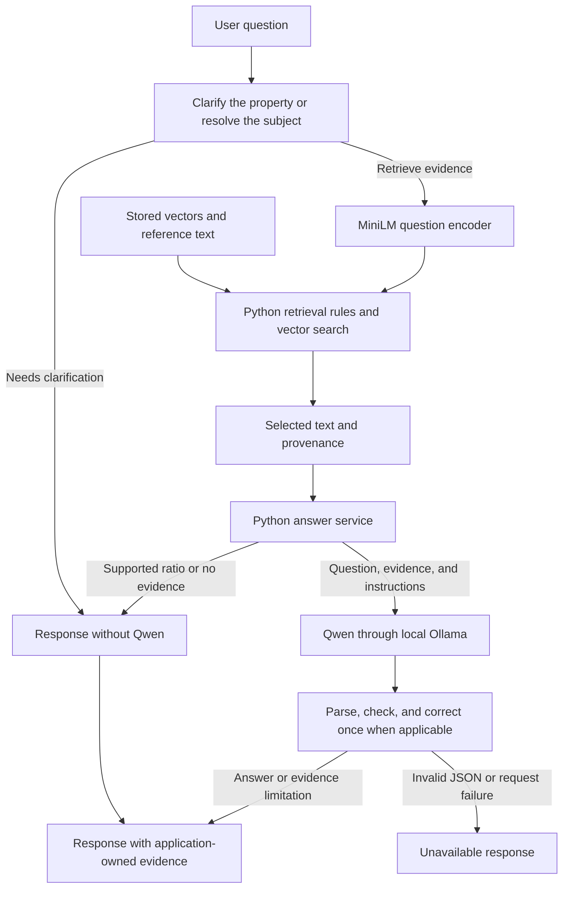
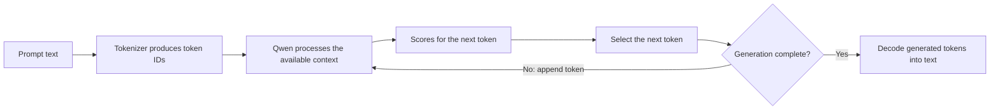
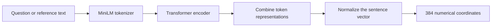
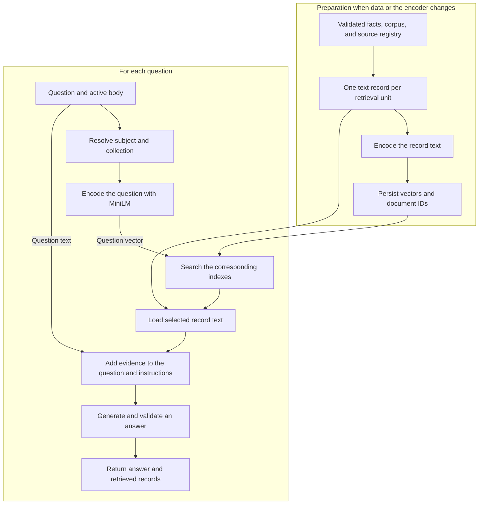
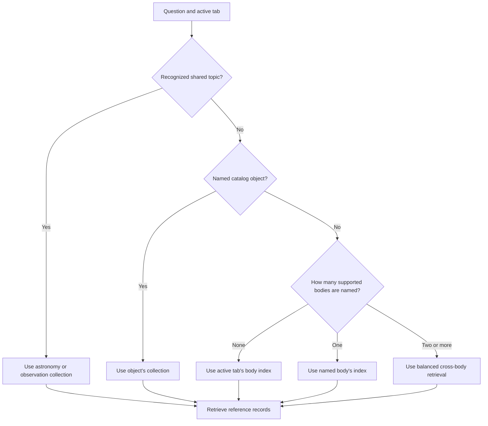
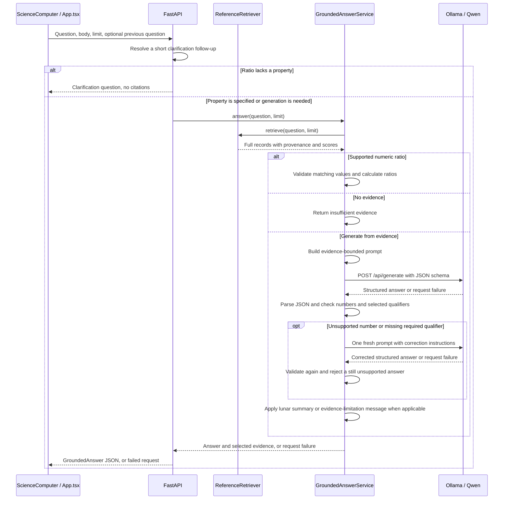

# Local LLMs, embeddings, and RAG

PlanetaryScanner is a learning project about building an application around language models. The planetary scanner is its interface: a way to ask questions, inspect scientific reference data, and see the system at work.

The main engineering work sits behind that interface. It involves running a language model locally, encoding text for semantic search, selecting useful evidence, constructing a prompt, and checking the returned answer. This guide explains those steps from the underlying concepts to the code in this repository.

Start with the [README](../README.md) to install and run the application. The examples here assume the API uses its documented default address, `http://127.0.0.1:8000`. Substitute your API port if it differs.

## Contents

1. [The three responsibilities](#the-three-responsibilities)
2. [The LLM: generating an answer](#the-llm-generating-an-answer)
3. [The encoder: finding related text](#the-encoder-finding-related-text)
4. [RAG: connecting retrieval and generation](#rag-connecting-retrieval-and-generation)
5. [Preparing the reference data](#preparing-the-reference-data)
6. [Choosing evidence for a question](#choosing-evidence-for-a-question)
7. [Building and processing an answer](#building-and-processing-an-answer)
8. [A question from start to finish](#a-question-from-start-to-finish)
9. [Comparisons, composition, and scientific scope](#comparisons-composition-and-scientific-scope)
10. [Reading scores and diagrams](#reading-scores-and-diagrams)
11. [Evaluation and its limits](#evaluation-and-its-limits)
12. [Experiments to run locally](#experiments-to-run-locally)
13. [Performance and reproducibility](#performance-and-reproducibility)
14. [Finding the implementation](#finding-the-implementation)
15. [Glossary](#glossary)

## The three responsibilities



The encoder represents text as vectors. Retrieval selects evidence, and the language model generates text from a prompt containing that evidence.

| Component                    | Implementation                               | Responsibility                                                              |
| ---------------------------- | -------------------------------------------- | --------------------------------------------------------------------------- |
| Large language model, or LLM | `qwen2.5:3b` through Ollama                  | Write a readable answer from the supplied question and evidence             |
| Text encoder                 | `sentence-transformers/all-MiniLM-L6-v2`     | Convert questions and reference text into comparable numerical vectors      |
| RAG pipeline                 | Python retrieval, prompt, and answer modules | Route the question, retrieve records, supply context, and return the result |

These are separate responsibilities. RAG is the application workflow that connects the models. It is not another model downloaded alongside Qwen and MiniLM.

The current system uses existing model weights. It does not train Qwen or MiniLM on planetary data. The custom work is the evidence collection, indexing, retrieval rules, prompt design, integration, and evaluation.

### How the application improves answers

The improvements change what reaches Qwen and what the application accepts from it. They do not change the model's learned weights.

| Change                                                 | Example                                                                                 | Purpose                                                             |
| ------------------------------------------------------ | --------------------------------------------------------------------------------------- | ------------------------------------------------------------------- |
| Clarify an unspecified ratio                           | “What is the ratio between all four bodies?” asks which property to compare             | Avoid guessing that the question means mass, radius, or composition |
| Select matching properties for each body               | A mass comparison retrieves a mass record for every requested body                      | Prevent unrelated measurements from becoming a comparison           |
| Calculate supported ratios in Python                   | A four-body mass ratio uses Earth as the baseline of 1                                  | Keep arithmetic outside generated prose                             |
| Route catalog objects and shared topics                | Tycho selects a lunar feature. Exoplanet questions use the shared astronomy collection  | Find evidence regardless of the active viewer tab                   |
| Retain scientific scope in the prompt                  | Lunar oxide values exclude the core. Solar composition is by number                     | Reduce changes to the physical meaning of a record                  |
| Check generated numbers and selected qualifiers        | Unsupported numbers or an omitted minimum-mass qualifier trigger one correction attempt | Reject specific errors before displaying an answer                  |
| Replace an insufficient answer with a clear limitation | A refusal does not also present unrelated measurements                                  | Avoid confusing partial answers                                     |

For the original four-body ratio question, the first response is now a clarification. A short reply such as “mass” selects the property, retrieves comparable records, and returns a Python calculation. It no longer needs Qwen to infer the property or perform the arithmetic.

The larger corpus gives retrieval more material to search. Most new records describe surface features, so the increased count should not be read as an equal increase in explanatory depth. Targeted retrieval checks and representative CPU answers have been exercised. A broad real-model answer benchmark is still needed to measure overall quality.

## The LLM: generating an answer

### What a language model does



A generative language model produces a sequence by repeatedly selecting a next token.

A token is a unit of text defined by a model's tokenizer. It may represent a word, part of a word, punctuation, or another text fragment. Token IDs are vocabulary identifiers. They are not the semantic search vectors discussed later. Different models can tokenize the same sentence differently. [Hugging Face's tokenizer documentation](https://huggingface.co/docs/transformers/main/en/tokenizer_summary) explains the common algorithms.

At each generation step, the model processes the prompt and the text generated so far, then scores possible next tokens. A decoding method selects one of them. Repeating this process produces an answer. This is called autoregressive generation. [Hugging Face's text generation documentation](https://huggingface.co/docs/transformers/main/en/llm_tutorial) describes this process and its controls.

For this application, the prompt contains the question, retrieved reference facts, and instructions. The desired continuation is a JSON object containing an answer and an evidence-status flag.

### Parameters, attention, and context

Parameters are the numerical weights learned during model training. They encode patterns that let a model relate input text to possible continuations. They are separate from the reference records stored in this repository.

Qwen is a Transformer language model. Attention is part of how a Transformer combines information from different token positions. In a causal language model, a generated token can depend on the preceding context. Attention weights are internal calculations. They do not provide a certificate that a scientific claim is true. The original architecture is described in [Attention Is All You Need](https://arxiv.org/html/1706.03762v7).

The context window is the amount of tokenized text the runtime can process for a request. Instructions, evidence, the question, and generated output consume space. A model's published maximum and a local runtime's configured context can differ. This application does not explicitly set Ollama's `num_ctx`, so its effective context depends on the installed runtime and configuration.

Each generated answer uses a fresh prompt. The application does not forward conversation history or Ollama's returned generation context. It retains one ambiguous ratio question so a short follow-up such as “mass” can resolve the requested property and bodies. This context is used for routing, not as scientific evidence.

### The model used here

The default answer model is `qwen2.5:3b`. The associated Qwen2.5 instruction model has approximately 3.09 billion parameters. Instruction tuning prepares a pretrained model to respond to requests rather than only continue arbitrary text. See the [Qwen model card](https://huggingface.co/Qwen/Qwen2.5-3B-Instruct) for the underlying model details.

Ollama runs the model and exposes an HTTP interface. The Python application sends requests to Ollama. It does not implement Qwen's neural network itself.

A larger model in the same family may follow instructions and combine evidence more reliably, but this remains an expectation until measured on this application's questions. More parameters do not repair missing evidence or an incorrect reference record. Replacing Qwen also leaves the MiniLM retrieval stage unchanged. Compare answer correctness, retained qualifiers, refusals, and response times before selecting a larger default. No 7B or 14B answer benchmark has been run for this project.

The [Ollama model listing](https://ollama.com/library/qwen2.5:3b) identifies the distributed `3b` artifact as `Q4_K_M`. This is a quantized representation of the model weights. Quantization reduces the storage and memory needed for weights by representing them with lower precision. The exact local artifact should be inspected when comparing results, because a model tag alone is not a complete reproducibility record.

### Why a plausible answer can still be wrong

In this application, generating valid prose and answering from the right evidence are separate requirements. A model can produce a fluent sentence that changes a number, omits a qualifier, or answers from information learned before this project existed.

For example, a retrieved lunar composition estimate describes the mantle and crust while excluding the metallic core. An answer that presents the same percentages as the composition of the entire Moon changes the meaning of the evidence, even if every number is copied correctly.

The prompt instructs Qwen to use only the supplied records. That is an instruction to the model, not a mechanism that erases its pretrained knowledge or proves compliance. The application therefore needs retrieval checks, response validation, and answer evaluation as separate layers.

### Generation settings in this repository

| Setting                         | Current value                  | Effect in this application                                                                                        |
| ------------------------------- | ------------------------------ | ----------------------------------------------------------------------------------------------------------------- |
| Model                           | `qwen2.5:3b`                   | Default model requested by the adapter                                                                            |
| Temperature                     | `0`                            | Uses a low-variability generation setting. It does not guarantee correctness or identical results across runtimes |
| Output format                   | Pydantic-generated JSON schema | Requests an `answer` string and an `insufficient_evidence` boolean                                                |
| Streaming                       | `False`                        | Waits for the full result before returning it to the browser                                                      |
| HTTP timeout                    | 120 seconds                    | Limits how long the adapter waits for Ollama                                                                      |
| Context and output token limits | Not explicitly set             | Uses the runtime's defaults and model configuration                                                               |

The adapter calls `/api/generate`, then validates the returned JSON with Pydantic. Ollama documents the endpoint and its response-format options in the [generate API reference](https://docs.ollama.com/api/generate).

## The encoder: finding related text

### What an encoder produces



The sentence encoder converts a variable-length text input into a fixed-length vector for comparison.

An embedding is a list of numerical coordinates representing a text input in a learned space. The encoder is the model that produces it. Related texts can have similar vector directions even when they use different words. Sentence embeddings and efficient similarity comparison are described in the [Sentence-BERT paper](https://arxiv.org/abs/1908.10084).

Consider these two questions:

> How much does Earth weigh?
>
> What is Earth's mass?

An exact phrase search may treat them differently. An embedding model can place them near text about Earth's mass. This is useful for retrieval, although it does not mean the model reliably distinguishes every scientific meaning of “weight” and “mass.”

### MiniLM in this project

The repository uses `sentence-transformers/all-MiniLM-L6-v2`. Its model card specifies a 384-dimensional sentence embedding and a default input limit of 256 word pieces, after which text is truncated. The Sentence Transformers wrapper performs pooling to form a sentence vector. See the [MiniLM model card](https://huggingface.co/sentence-transformers/all-MiniLM-L6-v2).

The code calls `encode(..., normalize_embeddings=True)` for both documents and questions. Document embeddings are computed when an index is built. A question embedding is computed when a user asks a question.

The same embedding model must produce both. A 384-dimensional vector from a different model is not automatically compatible just because its length matches. Its coordinates may represent a different learned space.

The 384 coordinates are not named scientific properties. Coordinate 12 does not mean temperature, and coordinate 200 does not mean gravity. Meaning is represented across the vector. The full sentence embedding also cannot be treated as a lossless copy of the original record.

Qwen has internal token representations of its own. This application never passes MiniLM's vectors to Qwen as inputs. It uses those vectors to select records, then passes the records' original text to the language model.

### Measuring similarity

The repository normalizes vectors to approximately unit length. For normalized vectors, their dot product equals cosine similarity:

```text
cosine(q, d) = (q · d) / (||q|| × ||d||)

When ||q|| = ||d|| = 1:
cosine(q, d) = q · d
```

Here, `q` is a question vector and `d` is a document vector. Cosine similarity compares their directions. Its mathematical range is from `-1` to `1`. A larger score indicates greater directional similarity.

The actual search operation is short:

```python
scores = index.vectors @ question_vector[0]
```

Each row of `index.vectors` is one document embedding. Matrix multiplication compares the question against every row. The code then ranks document IDs by their scores.

For a simple two-dimensional illustration, let `q = [1, 0]`. A unit document vector `[0.8, 0.6]` has similarity `0.8`. `[0, 1]` has similarity `0`. These are teaching vectors, not real MiniLM outputs.

Similarity measures relatedness according to the encoder. It does not measure whether a fact is true, whether a question is answerable, or whether an answer is scientifically valid.

## RAG: connecting retrieval and generation



RAG separates preparing searchable evidence from using that evidence during a request.

Retrieval-augmented generation means generating an answer with information retrieved for the current question. Retrieval selects evidence. Augmentation places that evidence into the model's input. Generation produces the response. The approach is introduced in [Retrieval-Augmented Generation for Knowledge-Intensive NLP Tasks](https://arxiv.org/abs/2005.11401).

The diagram shows the generation path over validated reference records. The application also asks for clarification before retrieval and calculates supported numeric ratios directly from retrieved metadata. These paths do not call Qwen. The encoder and answer model remain pretrained components. The repository does not reproduce the paper's training system.

RAG lets the application change its reference data without retraining the answer model. Updating a fact requires updating its retrieval record and embedding index so that the new text reaches later prompts. Changing a JSON file alone does not update the cached retrieval resources.

### RAG, fine-tuning, and direct lookup

| Approach      | What changes                                     | Example in this project                                        |
| ------------- | ------------------------------------------------ | -------------------------------------------------------------- |
| Direct lookup | Application selects a stored field               | A side panel reads the mean radius from the reference dataset  |
| RAG           | Evidence in the prompt changes for each question | The science computer retrieves radius records before answering |
| Fine-tuning   | Model weights change through additional training | Not implemented in this repository                             |

Direct lookup is sufficient for displaying a known field. The learning value of RAG appears when a question uses unfamiliar wording, asks for several properties, or requests a comparison that needs multiple records and a readable explanation.

The visible globe and the answer pipeline use separate data paths. Qwen receives reference text. It does not inspect Cesium imagery, read pixels, calculate properties from a solar image, or discover deposits by looking at the map.

## Preparing the reference data

### Facts carry meaning and provenance

The source data lives in [`data/reference`](../data/reference). Small body JSON datasets supply the viewer panels. Larger research records live in `corpus/*.jsonl`. The index builder merges both into six searchable collections, each with a JSON Lines retrieval file and a NumPy vector archive. A shared source registry records publications and services.

| Fact field       | Purpose                               | Example from the Mars mean-radius fact   |
| ---------------- | ------------------------------------- | ---------------------------------------- |
| `fact_id`        | Stable identity                       | `mars-mean-radius`                       |
| `field`          | Machine-readable property             | `mean_radius`                            |
| `kind`           | Measurement or statement              | `measurement`                            |
| `value`          | Recorded value                        | `3389.5`                                 |
| `unit`           | How to interpret a measurement        | `km`                                     |
| `scope`          | Physical meaning and boundaries       | `volume_equivalent_sphere`               |
| `as_of`          | Reference date retained with the fact | `2019-12-12`                             |
| `source_id`      | Link to the source registry           | `jpl-planetary-physical-parameters-2019` |
| `source_locator` | Position within the source            | `Mars row, Mean Radius`                  |

Pydantic validation requires a unit for measurements and excludes units from statements. Dataset validation checks body prefixes, and the loader checks that cited source IDs exist in the registry. These checks validate the data's structure. They do not independently verify the publication or the scientific accuracy of a value.

### One fact becomes one retrieval document

The builder creates a `RagDocument` with an ID, searchable text, and structured metadata. The current Mars mean-radius record contains:

```text
Mars reference fact: mean radius is 3389.5 km.
Scope: volume equivalent sphere. As of: 2019-12-12.
Source: NASA Jet Propulsion Laboratory Solar System Dynamics,
Planetary Physical Parameters. Locator: Mars row, Mean Radius.
URL: https://ssd.jpl.nasa.gov/planets/phys_par.html.
```

Line breaks above are added for readability. Its stable document ID is `reference-fact-mars-mean-radius`.

This is the project's chunking strategy. A chunk is the unit retrieved and supplied as evidence. Rather than split long PDFs into overlapping paragraphs, the application creates one small document per curated fact. This makes each value easy to identify and cite. Broader answers then need several chunks to recover the relevant context.

The encoder embeds the complete `content` string, including scope and source text. Structured metadata is kept alongside it for filtering and application logic. If a record grows beyond the encoder's input limit, trailing text can be omitted from its embedding even though it remains in the stored record. That is one reason record length matters.

### What is stored in the index

An `.npz` archive contains `document_ids`, `vectors`, and `model_name`. Search returns IDs, which are joined to the full JSON Lines records. The vector archive is a derived search resource. The record text supplies the evidence sent to Qwen.

The indexed snapshot contains 5,956 records:

| Collection   | Reference records | Vector matrix shape |
| ------------ | ----------------- | ------------------- |
| Earth        | 625               | `625 × 384`         |
| Luna         | 2,134             | `2134 × 384`        |
| Mars         | 2,143             | `2143 × 384`        |
| Sol          | 733               | `733 × 384`         |
| Solar system | 102               | `102 × 384`         |
| Milky Way    | 219               | `219 × 384`         |

The four viewer tabs remain the selectable subjects. The two shared collections are internal retrieval resources, available from every tab. The header counts indexed records across all six collections. The frontend requests this count from `/health/science-computer` every ten seconds and when the browser window regains focus. The API recalculates the count when a record file's modification time or size changes. That count can update without a restart, while cached retrieval resources still require a restart after an index rebuild.

The corpus adds 4,074 named surface features from the USGS/IAU Gazetteer, 504 USGS earthquakes, 638 SILSO solar observations, 150 nearby NASA archive exoplanets, and 178 NASA educational explanations to the original 412 stored facts. Most of the increase is geographic coverage. A catalog entry is one record even when it contains several measurements. It is not a separate scientific paper or a new independent observation for every coordinate.

The Gazetteer import excludes lunar satellite letter designations and removes identical repeated feature IDs. Zero catalog diameters are treated as unavailable. Coordinates use the export's planetocentric latitude and east longitude convention. Earthquake records cover catalog events of magnitude at least 7.5 from 1900 through 2025, with variable historical completeness. A missing depth remains unavailable.

SILSO records cover yearly means from 1700 through 2025 and monthly means from 2000 through 2025. These are different aggregation periods, not literal counts of spots visible at one instant. Early yearly averages can have sparse coverage. The adapted records credit WDC-SILSO and retain its [CC BY-NC 4.0 license](https://creativecommons.org/licenses/by-nc/4.0/).

The exoplanet sample contains 150 nearest planets selected from default Planetary Systems solutions with reported distance at most 20 parsecs. Each profile retains one reference solution. Missing fields are omitted, limit flags stay limits, and radial-velocity minimum masses remain `M sin i` rather than true masses. Catalog measurements do not establish habitability or life.

[`corpus/manifest.json`](../data/reference/corpus/manifest.json) stores the download URLs, SHA-256 hashes, selection rules, and indexed counts. NASA explanations retain page citations and update dates. `KnowledgeRecord` validates collection names, identifiers, text, dates, and provenance. The builder rejects unregistered sources and duplicate IDs. The importer rejects non-finite numbers and invalid coordinates. These structural checks complement source review, rather than proving every scientific claim.

Search is an exact scan of the vectors with NumPy. At this scale it remains practical on CPU. The repository includes PostgreSQL/pgvector scaffolding, but the active answer path uses local `.npz` indexes and JSON Lines records. Running the database is not required for this path.

## Choosing evidence for a question

### Body routing comes first



Shared-topic rules route exoplanets, stellar concepts, the Milky Way, and related solar-system bodies to their collections. Named catalog objects can select Luna, Mars, or Milky Way records from another tab. For ordinary body questions, explicit body names take priority over the selected tab.

The routing function recognizes Earth, Mars, Moon/Luna/lunar, and Sun/Sol. It interprets “all three” as Earth, Mars, and Luna, and “all four” as those bodies plus Sol. “Earth's Moon” is normalized to avoid treating it as a request about two bodies.

For example, asking “What is Mars's mean radius?” while looking at Earth uses Mars's records. Asking “What is its mean radius?” uses the active tab. “What is Tycho's diameter?” selects the lunar crater. “Where in the Milky Way is the Sun?” uses galactic context. The generic word “star” routes to shared stellar explanations, rather than acting as a Sun/Sol alias. Qwen does not choose which collection to search.

### The default ranking blends semantics and words

For ordinary questions, `ReferenceRetriever` calculates semantic scores for every record in the selected index. It then adds an exact-term contribution:

```text
lexical_score = shared question/document tokens / unique question tokens

hybrid_score = 0.85 × ((cosine_score + 1) / 2)
             + 0.15 × lexical_score
```

The first term rescales cosine similarity. The second measures coverage of the question's tokens in the document. The weights are manually chosen application settings. They are not learned by Qwen or calibrated as confidence probabilities.

Tokenization for this exact-term check lowercases the text and uses a regular expression. It is different from the neural models' tokenizers. It performs no sophisticated language analysis or stop-word removal.

The default limit is three records. Ordinary retrieval removes selected records whose cosine score is more than 0.2 below the strongest selected cosine score. This reduces unrelated context in focused explanatory answers. The gap is an application rule, not a confidence threshold. The returned `score` is the original cosine similarity, while default ordering uses the hybrid score. The visible score therefore does not fully explain ranking. Calling the lower-level vector search directly also bypasses these retrieval rules.

### Explicit subjects and complete groups

Exact catalog names are normalized for case, accents, and word boundaries. A named feature or exoplanet selects its profile before whole-body property filters run. The displayed score remains its actual question-to-record cosine similarity. Dated solar queries select the requested annual or monthly observation, and an unavailable period returns no evidence. Earthquake queries with a year restrict candidates to events from that year. Phobos and Deimos queries select their own properties rather than Mars's mass or radius.

Shared collections skip whole-body property filters. An exoplanet radius or galactic mass question must not silently become a radius or mass lookup for the active planet. Comparisons of asteroids, comets, meteors, meteoroids, and meteorites collect the requested definitions together.

The retriever also has targeted behavior. A recognized property, such as mass or mean density, restricts selection to matching metadata fields. Compound questions can request several subjects, such as size and population. The retriever selects evidence for each. Density rules distinguish a body's average density from core, atmospheric, and exospheric density.

Broad composition questions retrieve the complete recognized composition group. This can exceed the requested limit of three. Without that expansion, a summary could omit some of the components simply because only three records reached the model.

Cross-body retrieval has its own rules. For recognized subjects, it selects a matching field for each named body. Otherwise, it retrieves at least three records per body. The `limit` argument is consequently not a strict global cap in every path.

There is no dedicated cross-encoder reranker, approximate-nearest-neighbor service, or automatic web search in this implementation. The retrieval behavior comes from the sentence encoder, a simple lexical contribution, and domain rules.

## Building and processing an answer



A request returns a clarification, a calculated ratio, a generated answer, or an evidence-limitation message. Connection failures, timeouts, or invalid JSON fail the request. The browser displays an unavailable message.

The prompt includes the question and each selected record's ID and full content. The Ollama adapter sends the instructions in the `system` field and the question and evidence in the `prompt` field. Its instructions cover factual answers, comparisons, units, model estimates, and insufficient evidence. Several rules address observed failure cases: percentages must retain their units, lunar oxide percentages exclude the core, and solar photospheric composition is measured by number.

The model may return only two fields:

```json
{
  "answer": "Mars's mean radius is 3389.5 km.",
  "insufficient_evidence": false
}
```

This is an illustrative valid response, not a promise of exact wording from a model run.

The application attaches selected records as `citations`. Qwen does not invent or choose their URLs. For generated answers, these are the records supplied in the prompt, including any that the answer did not use. For calculated ratios, they are the records used in the calculation. Citations alone do not prove that every generated sentence is supported.

Generated answers also pass a numeric-grounding check. It compares numbers in the answer with numbers in the supplied evidence, allowing common fraction-to-percent and ppm-to-percent conversions and a 0.5% relative rounding tolerance. A value absent from the evidence triggers one fresh correction request to Qwen with the same question and evidence. The rejected prose is not included in that request. If the corrected answer still adds unsupported numbers, the application rejects it. This check does not verify units or prove that a supported number was applied to the correct property, and it cannot detect every unsupported claim made without numbers.

Two catalog-specific checks also require explicit qualifiers. Answers about `M sin i` must describe a minimum mass, and dated sunspot answers must identify a mean activity index. Missing qualifiers trigger the same single correction attempt. These text checks cover those specific cases and do not constitute general semantic verification.

The UI displays the answer text and an insufficient-evidence message when applicable. The API response also contains citations and scores, but the current science-computer panel does not render those details.

### The lunar composition safeguard

One narrow case uses a deterministic summary after generation. If the retrieved evidence consists of exactly the six expected lunar oxide records, with the expected body, scope, numeric values, and `wt%` units, and Qwen has not reported insufficient evidence, the service constructs a complete summary from the metadata.

This prevents an omission or a missing core-exclusion qualifier in that specific group. The service still calls Qwen first. This safeguard is not a general validator for other answers, calculations, or composition comparisons.

### Insufficient evidence and failures

For generated answers, Qwen supplies the `insufficient_evidence` flag. When it is true, the application replaces the generated prose with an evidence-limitation message, preventing a refusal from also presenting unrelated figures. Empty retrieval results and missing or incompatible ratio values are rejected before generation. There is no minimum retrieval-score threshold for ordinary semantic search, so Qwen must still recognize when nearby records do not answer a question.

The API also returns `needs_clarification`. An unspecified ratio has this flag set to true, `insufficient_evidence` set to false, and no citations. Asking for a property is a normal clarification, not a failed evidence search.

An unavailable Ollama service, a timeout, or invalid generated JSON fails the request. The current UI shows a generic unavailable message. Connection and parsing failures are not retried, and there is no second-model fallback. The health endpoint checks whether the model appears in Ollama's model list. It does not run a full retrieval or generation test.

## A question from start to finish

Ask:

> What is Mars's mean radius?

1. The browser sends the question, active body, and a limit of three to `/answers/reference`.
2. Body routing finds “Mars” and selects the Mars retriever, even if Earth is the active tab.
3. MiniLM encodes the question into a normalized 384-dimensional vector.
4. The search calculates cosine similarity against the 2,143 Mars vectors. The explicit radius rule selects the highest-scoring matching radius record.
5. The selected ID is resolved to its full record. The prompt includes its value, unit, scope, date, and source.
6. Qwen receives that prompt through Ollama and generates a structured response.
7. Pydantic validates the response, and the service checks its numbers and applicable qualifiers. The service attaches the records and returns the answer to the browser.

A retrieval-only check against the current files returned:

| Selected record                   | Cosine score, rounded | Recorded value |
| --------------------------------- | --------------------- | -------------- |
| `reference-fact-mars-mean-radius` | 0.7341                | 3389.5 km      |

The requested limit is three, but the explicit property rule returns one relevant record. Equatorial radius and surface pressure are excluded from this answer's evidence rather than adding related or irrelevant measurements to the prompt.

The scores are observations from this repository's current index and encoder. They are not fixed expectations for every model revision, query wording, or future dataset.

## Comparisons, composition, and scientific scope

### A comparison needs evidence for each body

For “Compare all four bodies by radius,” the comparison retriever selects a mean-radius record for Earth, Mars, Luna, and Sol. It returns four records even when `limit=3`. The current values are 6371.0084, 3389.5, 1737.4, and 695700 km, respectively.

For size comparisons, the cross-body rule prefers mean radius where it is available. It avoids comparing one body's radius to another body's diameter just because those records happened to rank highly.

All returned values use kilometres, but their scope still matters. Sol's record is a solar reference mean radius, while the terrestrial-body records use their stated mean-radius definitions. Shared units make a comparison possible. They do not erase the definitions behind the measurements.

### A ratio needs a property and a baseline

“What is the ratio between the four bodies?” has no single numeric answer. Mass, radius, volume, density, and gravity give different ratios. The API asks which property to compare before loading retrieval resources or calling Qwen.

If the visitor then replies “mass”, the browser supplies the previous question, and the API resolves it into a four-body mass comparison. This is a narrow clarification mechanism, not general conversation memory. Changing tabs clears it.

For a ratio of one recognized numeric property, Python selects one matching record per requested body, checks that every body is covered, verifies matching units and compatible property fields, and rejects non-positive or non-finite values. It divides each value by Earth's value when Earth is included, otherwise by the first resolved body's value. The answer states that baseline and returns the calculation's records as citations. Qwen does not perform this arithmetic. Unit conversion and arbitrary composition ratios are not implemented by this calculation path.

### Composition records use different denominators

| Dataset | What the composition records describe             | Interpretation needed                          |
| ------- | ------------------------------------------------- | ---------------------------------------------- |
| Earth   | Bulk elemental mass-fraction model                | Elemental fractions of the whole-Earth model   |
| Mars    | Whole-planet bulk composition model estimates     | Model scope must remain attached to the values |
| Luna    | Warren-model bulk silicate oxide mass percentages | Mantle and crust, excluding the metallic core  |
| Sol     | Photospheric elemental abundance by number        | Atom-count abundance in the photosphere        |

A lunar oxide mass percentage cannot be read as a whole-Moon elemental percentage. A solar atom-count abundance cannot be compared directly with a whole-planet mass fraction. An answer that ignores those differences can be numerically tidy and scientifically misleading.

The prompt warns about these distinctions, and complete-group retrieval preserves the records needed for synthesis. Neither step implements a general scientific conversion engine.

For “What is the Moon made of?”, the current retriever returns six oxide records. The deterministic summary includes silica 46.8, magnesia 36, iron oxide 9.24, alumina 3.87, lime 3.06, and titania 0.18 wt%, while explicitly retaining the mantle-and-crust model scope and core exclusion.

### Display conversions are separate

The frontend sometimes reformats stored values. Solar temperatures are shown in Celsius, while reference records can use Kelvin. Several panel bars turn dimensionless fractions into percentages.

Those display transformations do not rewrite the evidence supplied to Qwen. If a model answer and a panel use different units, inspect the underlying record and the conversion before treating them as contradictory. Similarly, a panel labelled “current” does not cause retrieval to refresh a dated reference measurement.

Fictional dilithium deposits are viewer content. They are outside the factual retrieval records and should not be described as scientific observations by the answer system.

## Reading scores and diagrams

A returned cosine score of `0.738` is not 73.8% confidence. It is not an accuracy percentage or a measurement uncertainty. It describes vector similarity for that question and record under the embedding model.

Several details matter when reading a result:

| Observation                    | What it means                                                                                          |
| ------------------------------ | ------------------------------------------------------------------------------------------------------ |
| High score                     | The encoder found the record semantically related. The record can still answer the wrong property      |
| Low score in a comparison      | A field rule may deliberately select matching properties despite modest similarity                     |
| Scores not in descending order | Default ranking can include a lexical boost, while the response exposes only cosine scores             |
| More records than the limit    | A composition or cross-body rule expanded the evidence set                                             |
| Citations present              | Those records were selected as evidence. Support for every generated claim remains a separate question |

The diagrams in this guide show software components, data flow, and request order. Their arrows describe operations or information passed between stages. They do not represent relationships learned from planetary data.

The current implementation has no knowledge graph and does not use GraphRAG. Its search space is a matrix of embeddings joined to text records by document ID. Visualizing selected documents as connected nodes would not, by itself, create a graph-based retrieval system.

## Evaluation and its limits

### Test retrieval separately from generation

The repository provides 52 retrieval evaluation cases across six collections: six Earth, sixteen Mars, seven Luna, eight Sol, six solar-system, and nine Milky Way cases. They cover existing planetary facts, named features, dated observations, related bodies, and astronomy concepts. Each case contains a question and expected document IDs. `evaluate_retrieval` records whether at least one expected ID appears.

The current metric named `recall_at_limit` is the fraction of cases with at least one expected ID in the returned results. For five cases with four hits, it reports `0.8`. If a case expects several records, retrieving just one passes that case. It is therefore a case-level hit rate, not a complete measure of evidence coverage for compound questions.

It also does not measure how many irrelevant records were included, whether the ranking is optimal, or whether the final answer used the evidence correctly.

### Evaluate the generated answer separately

The Earth grounded-answer evaluation set records required citations, required answer terms, and the expected insufficient-evidence status. An answer passes when all three checks pass.

| Check                 | What it verifies                               | What remains unverified                                           |
| --------------------- | ---------------------------------------------- | ----------------------------------------------------------------- |
| Required citation IDs | Expected evidence is present in the response   | Every generated claim is supported by that evidence               |
| Required answer terms | Specified text fragments appear, ignoring case | Full semantic correctness, negation, or unrelated false additions |
| Evidence-status flag  | The boolean matches the expected value         | Reliable refusal for every unsupported question                   |

For example, a wrong sentence can contain the expected number and unit. A substring check will not necessarily detect that it applies them to the wrong property. These evaluations are useful regression checks with defined limits.

Broader answer evaluation sets have not yet been added. The retrieval expectations and controlled unit tests are useful regression checks, but they are different from a measured real-model answer benchmark over representative questions.

### What the automated tests establish

The test suite checks data contracts, index persistence, retrieval rules, body routing, prompt constraints, response processing, and imagery behavior. Embedding models and answer services are replaced with controlled test doubles where needed. The suite does not require an actual model download or an Ollama process.

Passing those tests verifies application behavior under the tested conditions. It does not establish the real encoder's retrieval accuracy or Qwen's factual reliability. Real-model evaluation must explicitly run the encoder and generator with the relevant datasets and record its results.

When investigating a bad answer, inspect the retrieved records first. If the right evidence is absent, change retrieval or data preparation. If the right evidence is present but the answer changes its meaning, investigate the prompt, generation, and validation. If the underlying fact is wrong, correct the reference data and regenerate its derived resources.

## Experiments to run locally

### 1. Inspect retrieval without invoking Qwen

With the API running, request evidence directly:

```bash
curl --get 'http://127.0.0.1:8000/retrieval/reference' \
  --data-urlencode "question=What is Mars's mean radius?" \
  --data-urlencode 'body_id=earth' \
  --data-urlencode 'limit=3'
```

This uses the encoder and retriever without calling Ollama. Inspect the document IDs, content, metadata, and scores. The deliberately selected Earth default lets you verify that the explicit Mars name takes priority.

Try several phrasings, such as “What is Mars's mass?” and “How much does Mars weigh?” Compare which records survive changes in wording. Then try an unsupported question and observe that the retriever still returns nearby records.

### 2. Compare evidence with the generated answer

With Ollama and the default model available, call:

```bash
curl --get 'http://127.0.0.1:8000/answers/reference' \
  --data-urlencode "question=What is Mars's mean radius?" \
  --data-urlencode 'body_id=earth' \
  --data-urlencode 'limit=3'
```

Check the answer against the returned citations. Verify the requested property, its value, unit, and physical scope. Keep retrieval and generation observations separate so that a fluent answer cannot hide a retrieval failure.

### 3. Inspect the vector archive

Run this from the repository root:

```bash
uv run python - <<'PY'
from pathlib import Path
import numpy as np

path = Path('data/reference/mars-reference-vectors.npz')
with np.load(path, allow_pickle=False) as index:
    print('Model:', index['model_name'].item())
    print('Shape:', index['vectors'].shape)
    print('First ID:', index['document_ids'][0])
    print('Vector lengths:', np.linalg.norm(index['vectors'], axis=1))
PY
```

The current Mars matrix has shape `(2143, 384)`. Its vector lengths should be close to one, allowing small floating-point differences.

### 4. Evaluate real retrieval

This example uses the API's cached retriever and the existing Mars expectations. It needs the embedding model but does not need Ollama:

```bash
uv run python - <<'PY'
from pathlib import Path

from planetary_scanner.api.main import get_reference_retriever
from planetary_scanner.models.reference import load_validated_retrieval_evaluation_set
from planetary_scanner.rag.reference_retrieval import load_reference_records
from planetary_scanner.rag.retrieval_evaluation import evaluate_retrieval

root = Path('data')
documents = list(load_reference_records(
    root / 'reference/mars-reference-records.jsonl'
).values())
cases = load_validated_retrieval_evaluation_set(
    root / 'evaluation/mars-reference-retrieval.json', documents
)
retriever = get_reference_retriever('mars')

def retrieve_ids(question, limit):
    return [record.document.document_id
            for record in retriever.retrieve(question, limit)]

report = evaluate_retrieval(cases, retrieve_ids, limit=3)
print(report.model_dump_json(indent=2))
PY
```

Inspect failing cases individually rather than only the aggregate metric. Repeating with limits of one and three helps show how evidence selection affects the result.

### 5. Test scope and evidence gaps

| Question                                  | What to inspect                                                                                |
| ----------------------------------------- | ---------------------------------------------------------------------------------------------- |
| “Compare all four bodies by radius”       | One comparable radius record for every body                                                    |
| “What is the Moon made of?”               | All six curated oxide values and the core-exclusion qualifier                                  |
| “Compare the Moon and Sun by composition” | Whether the answer preserves their different abundance definitions                             |
| “What is Mars's most common mineral?”     | Whether the records actually support the requested claim and the model declines if they do not |

These are exploratory checks, not promised pass cases. Save the question, retrieved IDs, answer, model artifact, and observed failure when turning one into an evaluation case.

## Performance and reproducibility

### Local execution and CPU support

“Local” means the answer model runs on the machine hosting Ollama. When that machine is an EC2 instance, inference happens on that server rather than in the visitor's browser. The configured `OLLAMA_BASE_URL` determines where the API sends prompts.

The application can run on a CPU. Model loading, prompt processing, and token generation contribute to response time. A GPU can accelerate model computation, but availability of a GPU does not change the evidence-selection rules or guarantee better answers.

The API caches embedding models and collection retrievers within each process. A first request may load the encoder or download uncached model files. Later requests reuse those objects. Multiple API worker processes can each load their own copies.

Reference vectors are precomputed, so document embedding is not repeated for every question. The question still needs encoding, and Qwen still needs to process the assembled prompt and generate its response.

Model files and memory usage are different quantities. Inference also needs runtime buffers and context-related memory, so the downloaded model's file size is not a complete RAM requirement. Ollama's [FAQ](https://docs.ollama.com/faq) covers runtime configuration and context-related memory considerations.

The UI's QUERY timer covers the complete answer request. It includes retrieval, possible initialization, generation, and transport, or the shorter clarification and calculation paths. It does not measure the encoder alone.

### Reference updates require coordinated changes

To update the evidence consistently:

1. Edit the body dataset or validated corpus records and their source registry entries.
2. Validate sources and regenerate retrieval text with `build_collection_documents`.
3. Rebuild its vector archive with the matching embedding model.
4. Re-run retrieval and answer evaluations for affected questions.
5. Restart the API so its cached retrievers use the updated files.

Run the indexing command from the repository root after editing reference data:

```bash
uv run python scripts/rebuild_reference_indexes.py
```

It validates source registrations and regenerates the JSON Lines records and vector archives for all six collections. Use `--body luna` to rebuild one collection, or repeat `--body` for a subset. `--model` selects the encoder. Changing it requires rebuilding every index used together. Restart the API after rebuilding.

To import fresh catalog snapshots and run real-encoder retrieval checks:

```bash
uv run python scripts/import_reference_corpus.py --refresh
uv run python scripts/rebuild_reference_indexes.py
uv run python scripts/evaluate_reference_retrieval.py
```

The import caches downloads under ignored `data/downloads/reference-corpus`. It preserves fixed selection ranges and saves hashes of the downloaded bytes. Upstream catalogs change, so fetching them again is an update, not a guarantee of the same historical snapshot. Keep the cached files and use `--snapshot-date` when reproducing a saved import. The NASA explanations are curated records and are not rewritten by the download command.

The index stores a model name, but it does not store a content hash for every record or a pinned model revision. The retriever checks that indexed IDs exist in the records. It does not detect every case where text changes while IDs remain the same. An old vector joined to revised text can therefore rank evidence using an outdated representation.

For repeatable experiments, record the dataset revision, embedding model revision, answer-model artifact, Ollama version, prompt version, retrieval settings, and hardware. Changing the encoder requires re-embedding documents. Changing Qwen affects generation and should trigger new answer evaluations, even if the vectors stay unchanged.

### Availability of the interface and the models

The imagery viewer and reference panels do not depend on Qwen generating answers. With cached model files and local reference data, the answer pipeline can operate without fetching imagery. The application's map layers and live solar observations still use external services.

The static demo build bundles reference data and selected imagery assets while removing the science computer. It demonstrates the viewer, not active RAG inference. The build does not publish or change a repository's visibility.

## Finding the implementation

| File                                                                                  | What to read there                                                                 |
| ------------------------------------------------------------------------------------- | ---------------------------------------------------------------------------------- |
| [`models/reference.py`](../src/planetary_scanner/models/reference.py)                 | Fact and source contracts, validation, and conversion to retrieval documents       |
| [`models/corpus.py`](../src/planetary_scanner/models/corpus.py)                       | Research-record contracts and merging summary facts with the larger corpus         |
| [`reference_import.py`](../src/planetary_scanner/reference_import.py)                 | Source downloads, catalog parsing, selection, and snapshot manifest                |
| [`rag/corpus_routing.py`](../src/planetary_scanner/rag/corpus_routing.py)             | Shared-topic routing and normalized catalog-name lookup                            |
| [`rag/reference_index.py`](../src/planetary_scanner/rag/reference_index.py)           | Embedding-model interface, vector creation, persistence, and cosine search         |
| [`rag/reference_retrieval.py`](../src/planetary_scanner/rag/reference_retrieval.py)   | Hybrid ranking, explicit subjects, composition expansion, and cross-body retrieval |
| [`rag/reference_answers.py`](../src/planetary_scanner/rag/reference_answers.py)       | Prompt, Ollama adapter, structured answer schema, citations, and lunar safeguard   |
| [`api/main.py`](../src/planetary_scanner/api/main.py)                                 | HTTP endpoints, body routing, lazy model loading, and process-local caches         |
| [`rag/retrieval_evaluation.py`](../src/planetary_scanner/rag/retrieval_evaluation.py) | Retrieval case results and aggregate hit-rate calculation                          |
| [`rag/answer_evaluation.py`](../src/planetary_scanner/rag/answer_evaluation.py)       | Citation, evidence-status, and answer-term checks                                  |
| [`App.tsx`](../frontend/src/App.tsx)                                                  | Request submission, active-body selection, timing, and response handling           |
| [`ScienceComputer.tsx`](../frontend/src/ScienceComputer.tsx)                          | Question form, answer display, and static-build exclusion                          |
| [`data/evaluation`](../data/evaluation)                                               | Versioned questions and expected retrieval or answer behavior                      |
| [`tests/README.md`](../tests/README.md)                                               | Automated test scope and commands                                                  |

## Glossary

| Term              | Meaning in this project                                                          |
| ----------------- | -------------------------------------------------------------------------------- |
| LLM               | The generative language model used to write an answer                            |
| Encoder           | The model used to convert text into a semantic-search representation             |
| Embedding         | A numerical vector representing a text input                                     |
| Token             | A text unit defined by a model's tokenizer                                       |
| Parameter         | A learned numerical weight inside a model                                        |
| Inference         | Running a trained model on an input                                              |
| Training          | Adjusting model parameters using training data                                   |
| Fine-tuning       | Further training of an existing model. Not implemented here                      |
| Quantization      | Representing model weights at lower precision                                    |
| Context window    | Token capacity available to a model during a request                             |
| Chunk             | A retrieval unit. One summary fact, catalog profile, observation, or explanation |
| Vector index      | Stored document vectors and IDs used for similarity search                       |
| Cosine similarity | A comparison of vector directions                                                |
| Hybrid retrieval  | Ranking that combines semantic similarity and exact-term coverage                |
| Provenance        | The source, locator, date, and context retained with a fact                      |
| Scope             | What a measurement or statement physically describes                             |
| Grounding         | Tying an answer to supplied evidence. Something to evaluate, not assume          |
| RAG               | Retrieving evidence and supplying it to a model before generating an answer      |
| Hallucination     | Generated content that is unsupported or incorrect in its context                |
| Evaluation case   | A question with explicit expectations used to check behavior                     |
